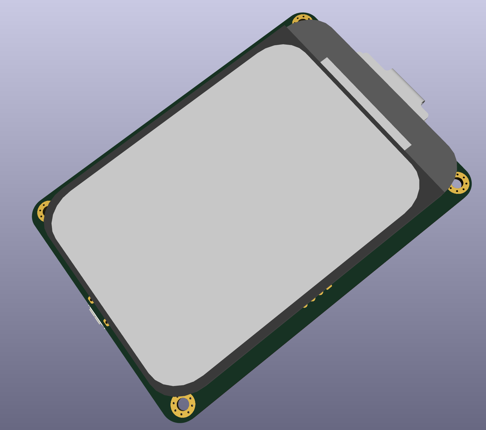
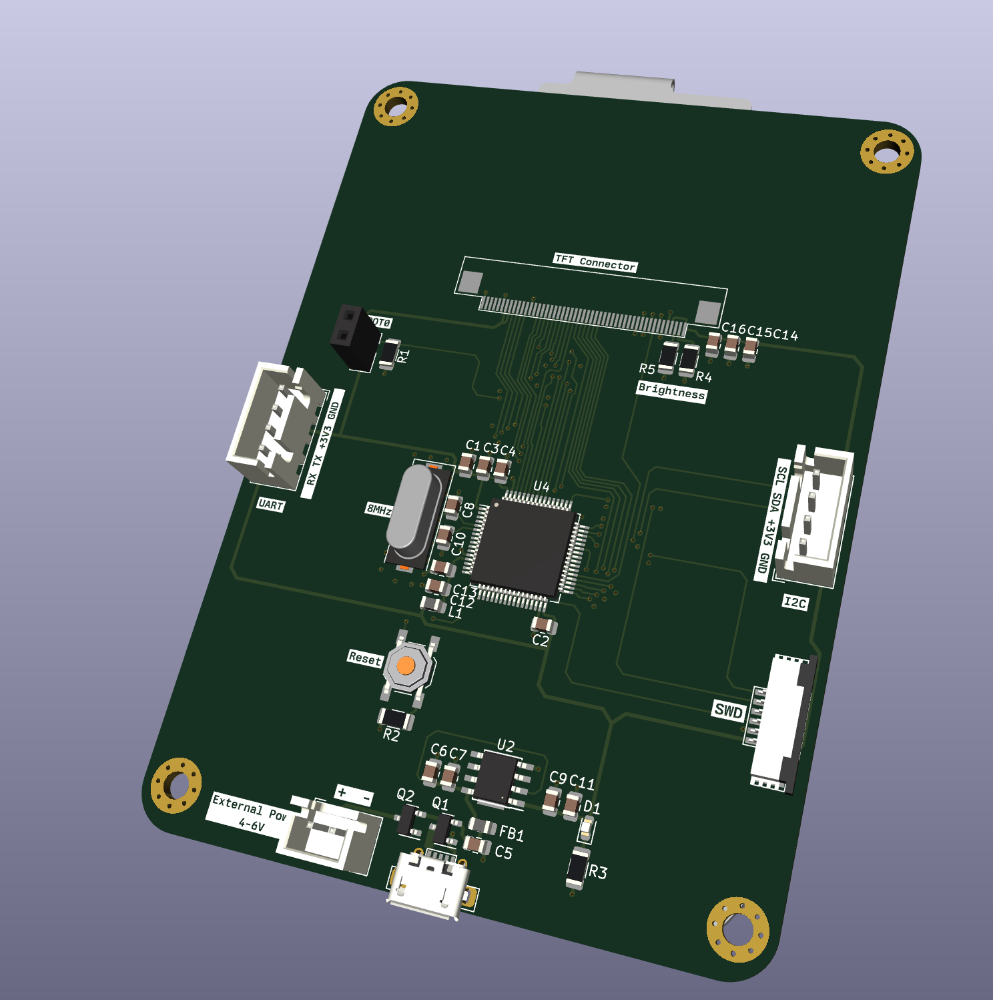

# ER-TFT040-1_STM32_Driver
STM32 Driver for the ER-TFT040-1 480x800 dots 4"(3.97") color tft lcd module display with NT35510 controller

LCD Display Panel](https://www.buydisplay.com/4-inch-3-97-inch-tft-lcd-display-module-480x800-optional-touch-screen)

The driver is based on the example code, refactored to work with the Adapter. It can be used standalone or with the adapter board. For standalone usage, you can copy the following files into your own project:

- [```STM32F446_Driver/Core/Inc/er_tft040.h```](STM32F446_Driver/Core/Inc/er_tft040.h)
- [```STM32F446_Driver/Core/Src/er_tft040.c```](STM32F446_Driver/Core/Src/er_tft040.c)
- [```STM32F446_Driver/Core/Inc/font_6_12.h```](STM32F446_Driver/Core/Inc/font_6_12.h)

If you recreate the adapter, then you just need to load the Driver into STM32CubeIDE (Or in Visual Studio Code) and program the MCU. The adapter is using a STM32F030R8T6 MCU, but you can replace it with any other STM32 if you want to extend the adapter. The only requirement is that you follow the pinout and connect them the same way as in the original design.



